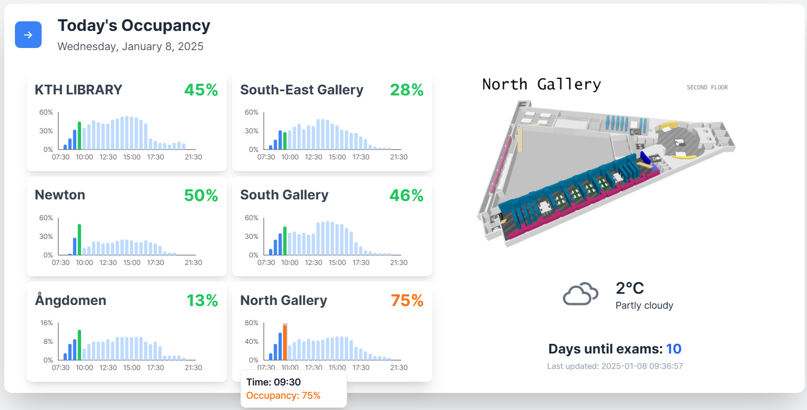
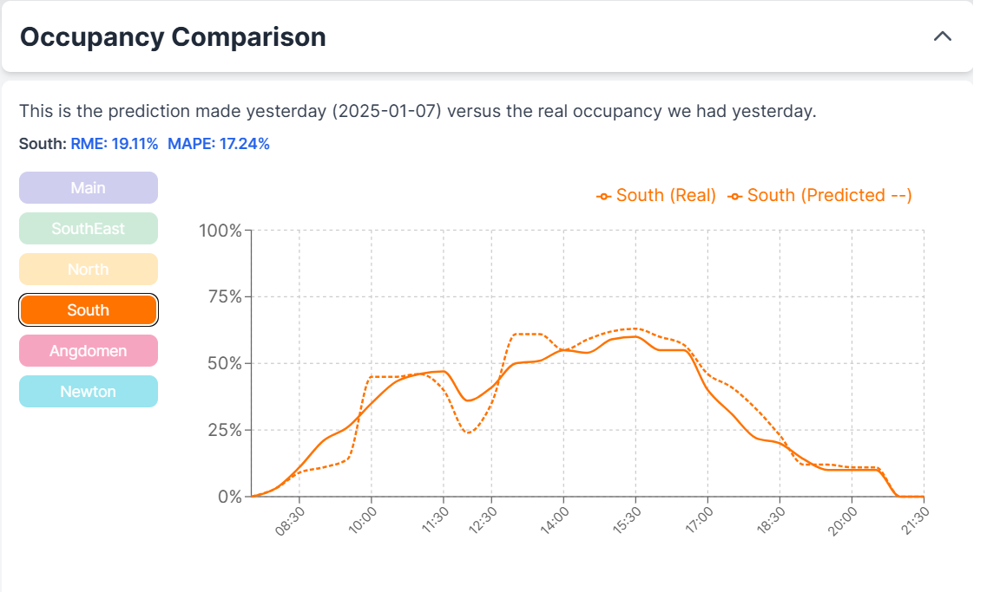

# Overview

Welcome to the repository for the **Library Seating Prediction Project**! This repository contains all the pipelines and scripts used for predicting library occupancy and powering the accompanying web application. 

You can explore the project at:  
[**KTH Seating Website**](https://kthseating.netlify.app/)

# Project Snapshots:

## Key UI Features:
- **Interactive Visualization**: The bar chart displays:
  - **Darker Blue Bars**: Historical library occupancy for the current day.
  - **Lighter Gray Bars**: Predicted future occupancy.
  - **Colored Bars**: Current real-time occupancy.  
- **Prediction Accuracy**: A second card on the webpage compares **predicted vs. actual occupancy** for a one-day-ahead forecast.

The front end of this project is a static website built using React. It dynamically integrates data by fetching it from an online CSV hosted on Hugging Face and retrieves real-time occupancy data from a Firebase database, which is updated every 2 minutes.

---
# Workflows and actions 
The workflow includes routines for scraping academic calendar data, retrieving weather information, applying forecasting models (such as Prophet and others), and comparing predicted vs. actual seat occupancy. The central notebook, **OBT_3_inference_3.ipynb**, consolidates the entire process, covering data merging, model training, and inference in a streamlined workflow.

Below is a brief description of each notebook:

---

## 1. OBT_3_inference_3.ipynb
This notebook serves as the **primary entry point** for the seat-occupancy forecasting workflow. It typically:

- **Merges** raw seat-occupancy data with external features (e.g., calendar events, weather, and library schedules).
- **Trains** or **loads** predictive models (often Prophet) for seat forecasting at various locations.
- **Generates** forecasts for upcoming dates, ensuring seat predictions are zero when the library is closed.
- **Outputs** relevant CSV files (e.g., `occupancy_today.csv`, `forecast_tomorrow.csv`) and plots, which you can share or upload to external services.

---

## 2. scraper_kth_days.ipynb
A notebook dedicated to **scraping or updating** day-level data related to KTH (e.g., academic events, normal or holiday schedules). Typical tasks might include:

- Pulling daily schedules or events from an online source.
- Converting these into a structured dataset (e.g., marking each date as “Exam,” “Re-exam,” “Holiday,” etc.).
- Possibly uploading the updated data to Hugging Face or storing it locally for integration into the main forecasting pipeline.

---

## 3. log_forecast.ipynb
This notebook focuses on a **log-based forecasting approach** or a logistic growth model for seat occupancy. Depending on your pipeline, it might:

- Configure a logistic growth function (e.g., using Prophet with `cap=100` for seat capacity).
- Integrate regressors (like weather or day-of-week flags).
- Produce a logged or logistic transformation of seat-occupancy data before forecasting.
- Compare normal vs. logistic forecasts to see which method is more accurate.

---

## 4. comparison_pred_reality.ipynb
A notebook designed to **compare predicted occupancy** to the **actual recorded usage**. Likely includes:

- Reading in historical seat-occupancy data and past predictions.
- Computing error metrics (Mean Absolute Error, RMSE, etc.).
- Visualizing differences between predicted and actual seat counts (line charts, residual plots, etc.).
- Summarizing insights to guide improvements or additional feature engineering.

---

## 5. KTH-scraper.ipynb
A **Selenium-based** or requests-based **web scraper** that retrieves academic schedule information directly from KTH’s official pages. Typical tasks might include:

- Navigating to the KTH Intranet (or public site) to gather exam dates, holiday periods, re-exam slots, and self-study intervals.
- Parsing raw HTML (e.g., with `BeautifulSoup` or Selenium) and extracting relevant date ranges.
- Generating an updated events calendar (Normal, Holiday, Exam, Re-exam, etc.) for future integration with the seat-occupancy pipeline.
- Optionally, pushing these updates to a Hugging Face dataset or storing them locally.

---

## 6. weatherData.ipynb
Handles **weather-data retrieval** and any preprocessing needed to align weather features with seat occupancy timestamps. Common steps:

- Calling an API (e.g., Open-Meteo) or loading a local/huggingface weather dataset.
- Cleaning and resampling weather metrics (temperature, precipitation, wind speed/direction) to match the forecast intervals (e.g., every 10 or 30 minutes).
- Merging or saving the final weather table for use by the main notebook (`OBT_3_inference_3.ipynb`) or other models.

---
