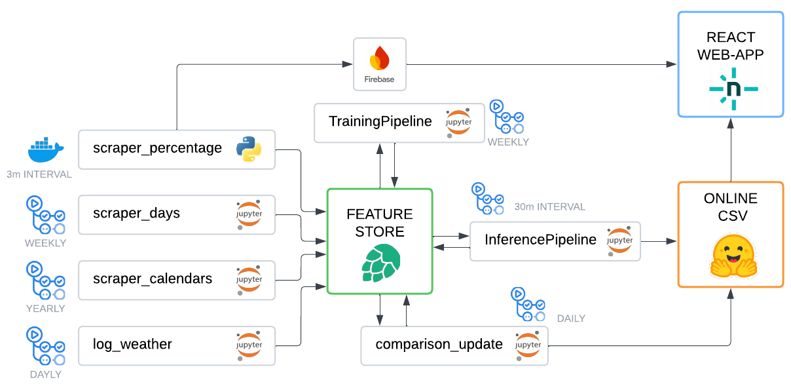

# KTH Seat Predictor - Hopsworks Branch

This repository is a branch of the main **KTH_seat_predictor** project, leveraging the Hopsworks service. The majority of the pipeline has been successfully migrated to the Hopsworks API framework. Although GitHub Actions are operational individually, they are not yet scheduled to run automatically.

  

